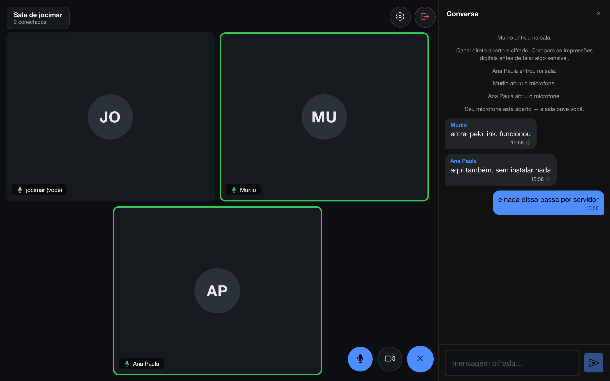
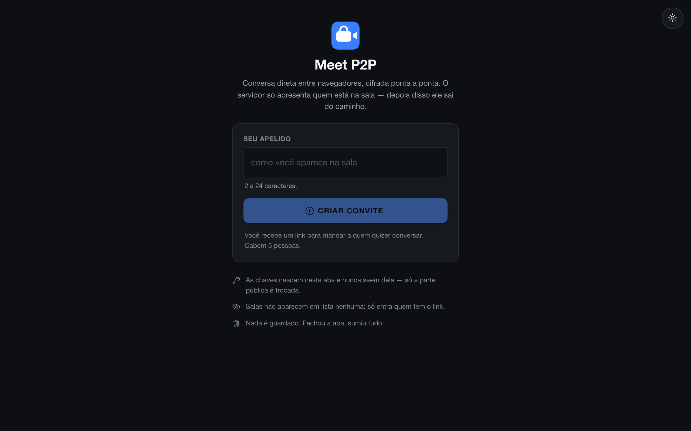
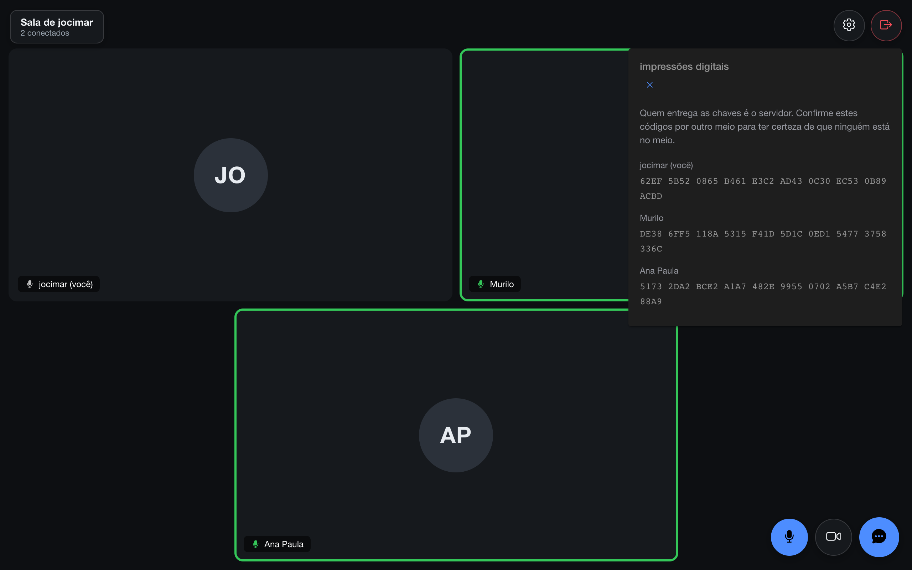

# Jolo Meet

Sala de vídeo, áudio e chat onde **as mensagens não passam por servidor nenhum**.
Os navegadores conversam diretamente entre si, e o texto vai cifrado de ponta a
ponta com PGP.

**[Abrir o Jolo Meet →](https://jocimarlopes.github.io/meet/)**



---

## Índice

- [O que é](#o-que-é)
- [Como funciona](#como-funciona)
- [Segurança: o que protege e o que não](#segurança-o-que-protege-e-o-que-não)
- [O que dá para fazer](#o-que-dá-para-fazer)
- [Stack](#stack)
- [Rodando local](#rodando-local)
- [Testes](#testes)
- [Aplicativo Android](#aplicativo-android)
- [Limitações conhecidas](#limitações-conhecidas)

---

## O que é

Você cria uma sala, recebe um link e manda para quem quiser. Quem abre escolhe
um apelido e entra direto — sem cadastro e sem instalar nada. Há também um
aplicativo Android, para quem quer print de tela bloqueado e código assinado.

A partir daí os navegadores se conectam **diretamente**, por WebRTC. Texto,
câmera e áudio trafegam de um para o outro sem tocar em nenhuma
infraestrutura. O servidor só apresenta as pessoas — nada do que vocês falam
passa por ele.

Não é um clone de Meet. É um exercício sobre uma pergunta específica: **quanto
dá para tirar do servidor sem perder o produto?**

<p align="center">
  
</p>

## Como funciona

```
Ana (navegador)              servidor              Bob (navegador)
     │                          │                        │
     │ 1. cria a sala + chave pública                     │
     ├─────────────────────────▶│                        │
     │ 2. recebe o link do convite                        │
     │◀─────────────────────────┤                        │
     │                                                    │
     │ 3. manda o link por fora (WhatsApp, e-mail, voz)   │
     ├───────────────────────────────────────────────────▶│
     │                          │                        │
     │                          │ 4. entra + chave pública│
     │                          │◀───────────────────────┤
     │ 5. recebe a chave dele   │                        │
     │◀─────────────────────────┤                        │
     │ 6. troca de SDP e ICE ──▶│ ──────────▶            │
     │                          │                        │
     │ 7. conexão direta: texto cifrado, vídeo e áudio    │
     │◀══════════════════════════════════════════════════▶│
```

Nos passos 1 a 6 o servidor faz três coisas: guarda a sala, garante que dois
participantes não usem o mesmo apelido e repassa os dados de conexão do WebRTC.
Ele nunca vê conteúdo.

Do passo 7 em diante, a conversa é direta. A conexão com o servidor continua
aberta, mas só para avisar quando alguém novo entra — é o que permite a sala
crescer durante a conversa. Mensagens, áudio e vídeo não passam por lá.

### Sala em grupo é uma malha

Até 10 pessoas por sala. Cada uma mantém uma conexão com cada outra — não existe
servidor de mídia retransmitindo nada, e é por isso que existe um teto: o custo
cresce ao quadrado. Com 10 participantes, cada um envia 9 fluxos.

Na prática isso significa que texto e áudio funcionam bem com a sala cheia, mas
**vídeo de todos ao mesmo tempo só se sustenta em grupos menores**. Não é
limitação de código: é o preço de não ter servidor no meio.

### Onde fica cada coisa

A primeira tela faz uma coisa só: abrir uma conversa. O resto vive num menu
lateral — **Salas**, com a lista das públicas, e **Sobre**, com o texto que
explica o projeto. Os dois estavam na home e empurravam para baixo a única
ação que importa ali. Durante a conversa o menu não existe: a chamada é tela
cheia, e nem o gesto de arrastar da borda o traz.

### Sala pública ou privada

Na criação você escolhe. **Privada** é o padrão: ela não aparece em lugar nenhum
e só é alcançável por quem receber o link. **Pública** entra numa lista na
própria home e qualquer pessoa pode entrar escolhendo um apelido. Sala cheia sai
da lista e volta quando alguém libera lugar.

Ao abrir uma pública você dá um **assunto** a ela — "Angular e Ionic", "dúvidas
de concurso", o que for. É o que aparece na lista, junto de quem hospeda e do
número de vagas, e é a única informação que alguém tem antes de entrar. Sala
privada não pede assunto: ela leva o nome de quem abriu, porque ninguém de fora
a lê.

A lista fica na tela **Salas** e aparece sempre, mesmo vazia — some da tela é o
que faz parecer quebrada. Ela não se atualiza sozinha em intervalo fixo:
carrega ao abrir, quando você volta para a aba e quando clica em atualizar.
Uma página esquecida aberta não consome nada. Escolher uma sala leva à mesma
tela de quem chega por link: ela pede o apelido, agora dizendo em qual sala
você está entrando.

### Toda sala dura 30 minutos

Contados da criação. A tela mostra o tempo de conversa e o quanto ainda resta,
lado a lado — os dois somam o prazo. Nos últimos cinco minutos o aviso fica
vermelho, e no fim a sala encerra avisando, em vez de morrer sem explicação.

O limite existe porque nada é guardado: uma sala eterna seria só um recurso
parado. Conversa mais longa é uma sala nova.

### Criptografia

Ao entrar, cada pessoa gera um par de chaves **PGP (Curve25519)** dentro do
próprio navegador. A chave privada nunca sai dali — só a parte pública é
trocada.

Cada mensagem é cifrada para todos os participantes de uma vez, num bloco só, e
**assinada**. Quem recebe verifica a assinatura contra a chave de quem enviou:
o escudo verde no balão significa que confere.

### Imagem no chat

Uma foto vai pelo mesmo caminho do texto: cifrada com PGP para todos de uma
vez e entregue pelo canal direto. Nada de upload, nada de link temporário — a
imagem existe na sua aba e na de quem está na sala, e some junto com ela.

Dois detalhes que não são óbvios. O **tipo e o nome do arquivo ficam dentro da
parte cifrada**: se viajassem do lado de fora, quem estivesse no caminho saberia
que você mandou `exame.jpg` sem precisar abrir nada. E a imagem é **reduzida
antes de sair**, encaixada numa caixa de 1024x768 sem distorcer — numa malha
cada foto sobe uma vez por participante, então mandar 3 MB numa sala de 10
seriam 27 MB saindo da sua conexão.

O canal também não aceita mensagem de qualquer tamanho, então a remessa vai
fatiada em pedaços de 48 KB, com controle de fluxo para não estourar o buffer e
derrubar a conexão.

Clicar na foto abre ela em tela cheia, com botão de baixar. O download sai do
blob que já está na sua máquina — nada é buscado de volta.

### Legendas do que está sendo falado

Ligadas no menu de configurações, aparecem no rodapé como numa legenda de
filme: **quem falou e o que falou**, sumindo sozinhas depois do silêncio.

A parte que importa: **o reconhecimento acontece no seu próprio aparelho**. A
API de fala do navegador, no modo padrão, manda o áudio para um serviço do
fabricante — num app que promete que nada sai daqui, seria contradição servida
de bandeja. Por isso a legenda exige `processLocally` e, se o aparelho não
souber reconhecer localmente, ela simplesmente não é oferecida.

Cada pessoa transcreve o **próprio** microfone e manda o texto cifrado pelo
canal direto, junto com as mensagens. Transcrever o áudio dos outros custaria
uma vez por participante e ainda não diria quem falou.

**A legenda segue o microfone.** O reconhecedor abre um fluxo de áudio próprio,
independente da faixa que vai para os outros — com o microfone fechado, ele
continuava ouvindo e transmitindo por escrito o que era dito. Mudo tem que ser
mudo, e por texto é até pior: fica legível.

**Um idioma por vez.** O modelo local é um pacote por língua, e a API não
aceita lista. Frase misturada sai errada, e isso não tem conserto do nosso
lado. O app usa o idioma do aparelho quando há modelo local para ele, e cai no
português quando não há.

São dois controles separados, e a separação é proposital: **legendar a própria
fala** e **ver legendas na tela**. Ninguém pode impedir outra pessoa de
transcrever a própria voz — isso acontece no aparelho dela, e um botão de "sala
sem legenda" seria cadeado sem porta. Mas cada um decide o que ocupa a própria
tela.

### Câmera e áudio no meio da conversa

Abrir a câmera depois que a conversa já começou é uma renegociação de WebRTC:
seria natural mandar o novo SDP pelo servidor, como no início. Em vez disso ele
viaja **pelo próprio canal direto entre os navegadores** — assim o servidor não
volta a participar de nada depois da apresentação.

A negociação usa *perfect negotiation*, então duas pessoas ligando a câmera ao
mesmo tempo não derrubam a conexão.

### Quem está falando

O WebRTC não informa isso. O app mede o nível de áudio de cada participante com
Web Audio e acende uma borda no quadro de quem fala. A alternativa seria
anunciar "estou falando" pelo canal de dados, o que gastaria banda e dependeria
da boa-fé do outro lado — medir o próprio sinal é sempre honesto.

## Segurança: o que protege e o que não

Esta seção existe porque prometer "seguro" sem qualificar é o tipo de coisa que
me faria desconfiar de um projeto alheio.

### O que o app garante

- **O servidor não lê suas mensagens.** Elas são cifradas antes de sair e
  trafegam por conexão direta. Nem o operador do servidor, com acesso total,
  consegue lê-las.
- **Seu provedor de internet não vê nada** além de metadados: com quem você
  conectou e quanto tráfego passou. Vídeo e áudio vão por DTLS-SRTP, obrigatório
  no WebRTC.
- **Nada é guardado.** Não há banco de dados de mensagens. As chaves vivem na
  memória da aba: fechou, sumiu.
- **Sala privada não é listável.** Não existe rota que enumere as privadas — só
  entra quem tem o link. As públicas aparecem por escolha explícita de quem
  criou.

### O que não garante

**O servidor poderia se colocar no meio.** É ele quem entrega a chave pública de
uma pessoa à outra; um servidor malicioso poderia entregar a chave dele para os
dois lados e ler tudo. Criptografia sozinha não resolve isso.

Por isso as duas pontas exibem a **impressão digital** da chave. Comparar esses
códigos por outro canal — uma ligação, pessoalmente — é o que fecha o buraco.
Sem essa conferência, você tem sigilo contra a rede, não contra o servidor.

<p align="center">
  
</p>

**Áudio e vídeo têm proteção mais fraca que o texto.** Vão cifrados por
DTLS-SRTP, mas não têm a camada PGP, e a conferência de digital não os cobre: a
identidade do canal de mídia viaja no SDP inicial, que passa pelo servidor.
Fechar isso exige assinar o SDP com a chave PGP — está mapeado, ainda não feito.

**O navegador e o sistema operacional veem tudo.** Depois de decifrada, a
mensagem existe em texto claro na sua tela. Extensões de navegador, teclado do
celular e o próprio SO têm acesso. Isso vale para qualquer aplicativo com
criptografia ponta a ponta, incluindo os famosos.

**Na web, o código é rebaixado a cada visita.** Quem controla a hospedagem
poderia servir uma versão adulterada, que leria tudo antes de qualquer cifra —
nenhuma criptografia dentro do app resolve isso, porque o atacante não quebra a
cifra, ele *é* o código que cifra.

**É por isso que existe o aplicativo Android.** Lá os arquivos vão dentro do
APK assinado: entregues uma vez e verificados pelo sistema, em vez de baixados
a cada abertura. A confiança não some, muda de lugar — passa da hospedagem para
quem assina e distribui o APK.

**O site tem Google Analytics.** Acessos e navegação são medidos, o que
significa que o Google vê o IP de quem entra. Isso não alcança as conversas:
mensagens, áudio e vídeo continuam cifrados e trafegando por conexão direta.
Mas se você não quer nem esse rastro, use uma janela anônima ou um bloqueador.

## O que dá para fazer

| | |
|---|---|
| **Sala por link** | Cria, copia o link, manda. Quem abre só escolhe um apelido |
| **Pública ou privada** | Privada só pelo link; pública aparece na lista da home com assunto |
| **Até 10 pessoas** | Malha direta, sem servidor de mídia |
| **Prazo de 30 min** | Com tempo de conversa e restante à vista |
| **Texto cifrado** | PGP ponta a ponta, com assinatura verificada por mensagem |
| **Imagem no chat** | Cifrada igual ao texto, com visualizador e download |
| **Câmera e microfone** | Independentes — dá para falar sem aparecer |
| **Quem está falando** | Borda no quadro, por detecção de nível de áudio |
| **Legendas** | Transcrição no próprio aparelho, no estilo de legenda de filme |
| **Apelido com etiqueta** | `ana#4821`, como no Discord: o nome repete, a identidade não |
| **Avisos sonoros** | Quando alguém entra e quando chega mensagem |
| **Tema claro e escuro** | Começa seguindo o sistema, e você pode discordar |
| **App Android** | Código assinado, print bloqueado e conversa em segundo plano |

## Stack

- **Angular 20 + Ionic 8**, publicado no GitHub Pages
- **WebRTC** com DataChannel e *perfect negotiation*
- **OpenPGP.js**, chaves Curve25519 geradas no navegador
- **Web Audio API** para detectar quem está falando

Todo o peso está aqui: a criptografia, a malha de conexões, a renegociação de
mídia e a detecção de fala rodam no navegador. O servidor de apresentação é um
WebSocket enxuto, que sai de cena assim que as pessoas se encontram.

## Rodando local

Requer Node 20.19+.

```bash
npm install
npx ng serve --port 8100
```

Abra `http://localhost:8100` em duas janelas: crie a sala numa, cole o link na
outra.

O endereço do servidor de apresentação fica em
[`src/environments/`](src/environments/) — é a única configuração externa do
projeto.

## Testes

```bash
npx ng test --watch=false
```

São 33 testes, incluindo um ciclo real de cifrar e decifrar com PGP: duas
identidades geradas de verdade, mensagem cifrada para ambas, assinatura
conferida e a garantia de que quem está fora da lista de destinatários não
abre nada.

O projeto também é coberto por testes que sobem navegadores de verdade e
verificam o que teste unitário não alcança — o handshake WebRTC com dois e com
três participantes, a renegociação da câmera pelo canal direto e,
principalmente, **o que sai no fio: só bloco PGP, sem o texto puro em lugar
nenhum**. São 102 verificações somadas.

## Aplicativo Android

A versão web é o caminho fácil; o aplicativo é o caminho seguro. Duas coisas só
existem nele:

**O código para de ser entregue a cada visita.** Vai dentro do APK assinado.
Fecha o maior furo da versão web.

**A conversa continua em segundo plano.** Dá para sair do app — jogar,
responder outra mensagem, desligar a tela — sem cair da chamada. Não é
automático: desde o Android 9, aplicativo em segundo plano não acessa o
microfone sem um serviço em primeiro plano declarado, e é por isso que uma
notificação permanente aparece enquanto o áudio está aberto. Medido: sem o
serviço a chamada morria em menos de 30 segundos; com ele, o áudio chega na
mesma taxa de antes.

**Print de tela é bloqueado.** Captura, gravação de tela, espelhamento e até a
miniatura no alternador de aplicativos — tudo sai preto. A conversa não sai
dali, com uma exceção deliberada: baixar uma imagem que você recebeu, que grava
o arquivo em Documentos.

Não é mágica. `FLAG_SECURE` não vence um aparelho com root nem uma câmera
apontada para a tela; ele fecha o caminho fácil, que é o do próprio sistema. E
o sistema operacional continua vendo tudo, como em qualquer aplicativo.

```bash
npx ng build --configuration production --base-href /
npx cap sync android
cd android && ./gradlew assembleDebug   # precisa de Java 21
```

O APK sai em `android/app/build/outputs/apk/debug/`.

## Limitações conhecidas

- **NAT simétrico.** Só há STUN configurado. Em algumas redes móveis e
  corporativas a conexão direta não fecha, e seria preciso um servidor TURN.
  Isso pesa mais no vídeo que no texto.
- **Teto de 10 pessoas**, pela natureza da malha — e vídeo de todos ao mesmo
  tempo pesa bem antes disso.
- **A sala acaba em 30 minutos**, sem prorrogação.
- **Sem histórico.** Fechou a aba, acabou. É de propósito.
- **O WebSocket fica aberto durante a conversa** — não para trafegar mensagens,
  mas para avisar quando alguém novo entra.
- **No aplicativo, a loja vira o ponto de confiança** no lugar da hospedagem.
  Um APK publicado com build reproduzível deixa qualquer pessoa conferir que o
  binário corresponde ao código.

---

[Política de Privacidade](src/politicas/privacidade.html) ·
[Termos de Uso](src/politicas/termos.html) — publicados junto com o site, em
`/politicas/`, e alcançáveis pela tela Sobre.

Feito por [Jocimar Lopes](https://github.com/jocimarlopes). Aberto a
oportunidades como desenvolvedor.
